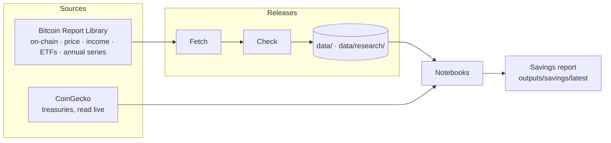

# Bitcoin Investment Strategy

Three Bitcoin notebooks from [Secret Satoshis](https://secretsatoshis.com): a savings plan you
can run against real price history, and two studies of bitcoin's supply and demand. The savings
plan is the companion to [**Should I buy bitcoin?**](https://newsletter.secretsatoshis.com/p/should-i-buy-bitcoin).

| Notebook | What it covers |
|---|---|
| [`bitcoin_savings_plan.ipynb`](notebooks/bitcoin_savings_plan.ipynb) | Saving a fixed share of income in bitcoin: what the plan has done to date |
| [`bitcoin_supply_dynamics.ipynb`](notebooks/bitcoin_supply_dynamics.ipynb) | How much bitcoin is dormant, and how much dormancy is ending: issuance, coin age, holder cohorts and realized profit and loss |
| [`bitcoin_demand_dynamics.ipynb`](notebooks/bitcoin_demand_dynamics.ipynb) | Where the bids come from: miners, on-chain participation, US spot ETFs, companies and governments, and price models |

## The savings plan

Set your income, the share going to bitcoin and to cash, how often you buy, and when you
started. The notebook then shows what that plan has done to date: sats accumulated, the
average price you paid, value against what you put in, a money-weighted return, and the
same contributions held as cash instead.

It also publishes a daily **savings report** in [`outputs/savings/latest/`](outputs/savings/latest/):
results for five yearly starting cohorts under fixed example assumptions ($100,000 income,
10% to bitcoin, 10% to cash at 3% APY, bought monthly), as tables and two charts.
Start with `savings_report.json`.

Purchases always use that day's observed price, nothing looks ahead, and results are nominal,
before fees and tax.

## Supply and demand

The supply notebook measures the age structure of the coins that exist: how much has sat
untouched for one to ten years, how much of it moves each day, and what the holders who move
it realize. The demand notebook takes the buyers one at a time (miners, on-chain participants,
US spot ETFs, companies and governments) and asks how each acquires coins, what evidence it
leaves, and what it paid.

## How it works



Everything except the treasuries comes from one [Bitcoin Report Library](https://github.com/SecretSatoshis/Bitcoin-Report-Library)
release, written as two data releases: `data/` for the savings plan and `data/research/` for the
supply and demand notebooks. Every file is listed with its checksum in its release's manifest,
and the notebooks check them before calculating anything. Company and government treasuries are
read from CoinGecko when the demand notebook runs and are never stored in the repository.

## Quick start

You need Python 3.12 and [uv](https://docs.astral.sh/uv/).

```bash
git clone https://github.com/SecretSatoshis/Bitcoin-Investment-Strategy.git
cd Bitcoin-Investment-Strategy
uv sync --locked
```

Refresh the data, then run the notebooks:

```bash
uv run --no-sync python scripts/update_data.py
uv run --no-sync python scripts/execute_notebooks.py
```

To change the savings plan, open its notebook in Jupyter or VS Code with this environment's
Python kernel and edit Section 1. Run the tests with:

```bash
uv run --no-sync python -m unittest discover -s tests
```

## Daily publication

A GitHub Actions workflow runs every day, scheduled for 07:17 UTC. It runs the tests,
refreshes both data releases (waiting up to three hours for that day's Report Library release),
runs the notebooks, checks the releases and the savings report, and commits them. The executed
notebooks embed their charts, so they are committed weekly to keep the repository small. Any
failed check stops publication and leaves the last release in place; if a supply or demand
notebook cannot run (CoinGecko can rate-limit), its last good copy stays.

## Project layout

| Path | What's there |
|------|--------------|
| `notebooks/` | The three notebooks |
| `src/bitcoin_investment_strategy/` | Savings engine, Report Library reader and checks, savings report and chart style |
| `src/bitcoin_investment_strategy/research/` | The supply and demand release, its checks, the CoinGecko reader and the notebooks' chart helpers |
| `scripts/` | Data update, notebook runner, validation and publication |
| `data/` | The savings data release: processed series and manifests |
| `data/research/` | The supply and demand data release |
| `data/reference/` | Secret Satoshis' classification of how each government acquired its bitcoin |
| `outputs/savings/latest/` | The latest savings report |
| `tests/` | Unit tests |

See [`DATA_SOURCES.md`](DATA_SOURCES.md) for each source and its limitations.

## Scope and risk

This is a research and educational tool, not investment advice. Past results do not
predict future ones.

## License

[GPL-3.0](LICENSE) for the code and original prose. Data keep their publishers' terms; see
[`DATA_SOURCES.md`](DATA_SOURCES.md) before redistributing.
