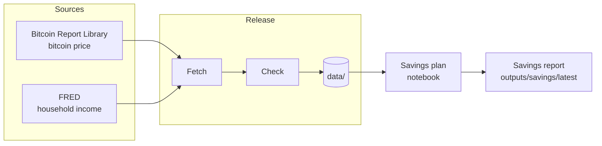

# Bitcoin Investment Strategy

A Bitcoin savings-plan notebook from [Secret Satoshis](https://secretsatoshis.com), and the
companion to [**Should I buy bitcoin?**](https://newsletter.secretsatoshis.com/p/should-i-buy-bitcoin).
The article sets out the idea of saving a fixed share of income in bitcoin; the notebook
lets you run it against real price history.

- **Open the notebook:** [`bitcoin_savings_plan.ipynb`](notebooks/bitcoin_savings_plan.ipynb)
- **Read the article:** [Should I buy bitcoin?](https://newsletter.secretsatoshis.com/p/should-i-buy-bitcoin)

## What it does

Set your income, the share going to bitcoin and to cash, how often you buy, and when you
started. The notebook then shows what that plan has done to date: sats accumulated, the
average price you paid, value against what you put in, a money-weighted return, and the
same contributions held as cash instead.

It also publishes a daily **savings report** in [`outputs/savings/latest/`](outputs/savings/latest/):
results for five yearly starting cohorts under fixed example assumptions ($100,000 income,
10% to bitcoin, 10% to cash at 3% APY, bought monthly), as tables and two charts.
Start with `section3_packet.json`.

## How it works



Every file in a release is listed with its checksum in `data/manifests/data_manifest.json`,
and the notebook checks them before calculating anything. Purchases always use that day's
observed price, nothing looks ahead, and results are nominal, before fees and tax.

## Quick start

You need Python 3.12 and [uv](https://docs.astral.sh/uv/).

```bash
git clone https://github.com/SecretSatoshis/Bitcoin-Investment-Strategy.git
cd Bitcoin-Investment-Strategy
uv sync --locked
```

Refresh the data, then run the notebook:

```bash
uv run --no-sync python scripts/update_data.py
uv run --no-sync python scripts/execute_notebooks.py
```

To change the plan, open the notebook in Jupyter or VS Code with this environment's Python
kernel and edit Section 1. Run the tests with:

```bash
uv run --no-sync python -m unittest discover -s tests
```

## Daily publication

A GitHub Actions workflow runs every day, scheduled for 07:17 UTC. It runs the tests,
refreshes the data (waiting up to three hours for that day's Report Library release), runs
the notebook, checks the release and the savings report, and
commits them. The executed notebook embeds its charts, so it is committed weekly to keep
the repository small. Any failed check stops publication and leaves the last release in place.

## Project layout

| Path | What's there |
|------|--------------|
| `notebooks/` | The savings plan notebook |
| `src/bitcoin_investment_strategy/` | Savings engine, data fetchers and checks, savings report and chart style |
| `scripts/` | Data update, notebook runner, validation and publication |
| `data/` | The data release: raw, processed and manifests |
| `outputs/savings/latest/` | The latest savings report |
| `tests/` | Unit tests |

See [`DATA_SOURCES.md`](DATA_SOURCES.md) for each source and its limitations.

## Scope and risk

This is a research and educational tool, not investment advice. Past results do not
predict future ones.

## License

[GPL-3.0](LICENSE) for the code and original prose. Data keep their publishers' terms; see
[`DATA_SOURCES.md`](DATA_SOURCES.md) before redistributing.
